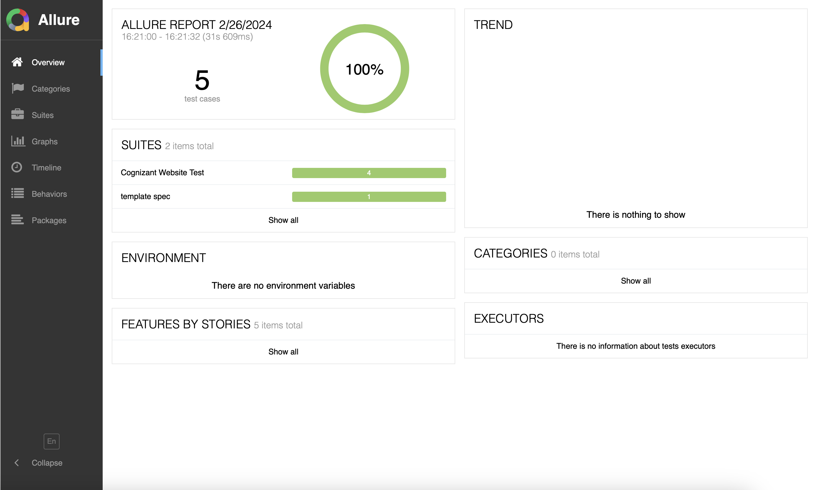

This project demonstrates  automatation of  [Cognizant](https://www.cognizant.com/) website

## Regression suite details
The latest e2e run details of this project can be viewed [here](https://thulasipavankumar.github.io/Cypress-demo/) 

| Branch | Test status    |
| :---:   | :---: | 
| [Main](https://github.com/thulasipavankumar/Cypress-demo/tree/main) |    | 
| Most recent run |    | 

## How to run the project
1. Download the project to local machine
2. Open the terminal/command prompt and use the command `npm install` to install dependencies 
3. To run the tests use the command `npm test`
4. After the test run, the results can be accessed in the folder `cypress/reports`
5. To change the browser  open the file `package.json` and modify the `test` command

## Sample screenshot of the [report](https://thulasipavankumar.github.io/Cypress-demo/)  

## Pre-requisite for running the project
- minimum node version 18
- minimum npm version 9.8
- A web browser to automate

# Contributions
-  `To raise a issue you can click` [here](https://github.com/thulasipavankumar/tobania-testing/issues/new)
